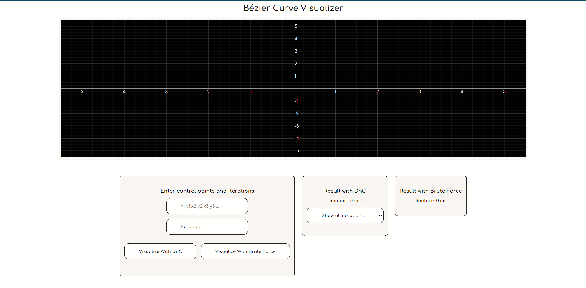
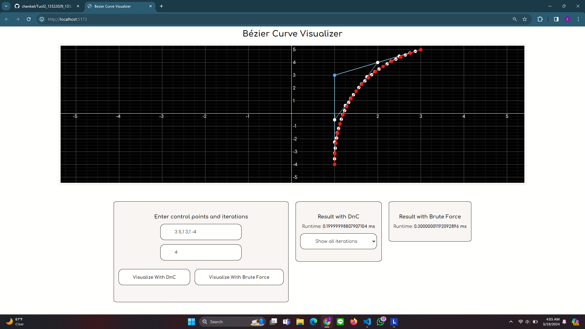

# Kurva Bezier dengan algoritma Titik Tengah berbasis Divide and Conquer
> Menentukan koordinat titik-titik Kurva Bezier dengan pendekatan Divide and Conquer 

## Table of Contents
* [General Info](#general-information)
* [Features](#features)
* [Screenshots](#screenshots)
* [Setup](#setup)
* [Usage](#usage)
* [Project Status](#project-status)
* [Contact](#contact)
<!-- * [License](#license) -->


## General Information
Kurva Bezier adalah kurva halus yang sering digunakan dalam desain grafis, animasi, dan manufaktur. Kurva ini dibuat dengan menghubungkan beberapa titik kontrol, yang menentukan bentuk dan arah kurva. Pembuatan kurva dapat dilakukan beberapa kali iterasi dengan algoritma titik tengah, yang akan mengaproksimasi bentuk Kurva Bezier. Semakin banyak jumlah iterasi yang dilakukan, maka hasil aproksimasi akan semakin mendekati bentuk Kurva Bezier. Pada repositori ini, akan dibangun Kurva Bezier dengan aproksimasi algoritma titik tengah yang berbasis konsep Divide and Conquer.

## Features
Beberapa Fitur dalam Program Visualisasi Kurva Beizer:
- Visualisasi hasil Kurva Bezier pada n titik kontrol dan k iterasi dengan Brute Force
- Visualisasi hasil Kurva Bezier pada n titik kontrol dan k iterasi dengan Divide and Conquer
- Visualisasi proses membangun Kurva Bezier pada tiap tahap iterasi
- Tampilan Runtime Program Brute Force ataupun Divide and Conquer
- Backup File Python untuk Visualisasi Kurva Bezier (Jika melalui web tidak responsif untuk jumlah iterasi banyak)

## Screenshots


<!-- If you have screenshots you'd like to share, include them here. -->


## Setup
Untuk menjalankan projek ini, sebelumnya diperlukan penginstalan beberapa komponen dengan langkah-langkah sebagai berikut:
1. Download Node.js dan npm [di sini](https://nodejs.org/en/download)
2. Clone Repository dengan menjalankan command berikut pada terminal anda
   ```git clone https://github.com/chankiel/Tucil2_13522029_13522050.git```
3. Navigasi ke direktori projek, dengan menjalankan command cd berikut sesuai direktori di komputer anda
   ```cd <project-directory>/Tucil2_13522029_13522050/src/bezier-curve-visualizer```
4. Install depedensi yang dibutuhkan dengan npm. Jalankan command berikut
   ```npm install```

## Usage
Untuk menjalankan Visualizer melalui Website, dapat menjalankan langkah-langkah berikut.
1. Navigasi ke direktori projek, dengan menjalankan command cd berikut
   ```cd src/bezier-curve-visualizer```
2. Jalankan command berikut untuk menjalankan localhost website
   ```npm run dev```
3. Akses website dengan mengunjungi link localhost berikut.
   ```http://localhost:5173```
4. Masukkan koordinat titik-titik sesuai format yang disediakan (minimal 3 titik)
   ```x1 y1,x2 y2,x3 y3,...,xn yn```
5. Masukkan jumlah iterasi yang ingin dilakukan (angka minimal 1)
6. Tekan tombol visualisasi sesuai jenis algoritma yang diinginkan (Divide and Conquer atau Brute Force)
----------
Untuk backup dengan Python, dapat menjalankan langkah-langkah berikut (dengan asumsi Python sudah terinstall).
1. Navigasi ke folder backup dengan menjalankan command cd berikut
   ```cd src/bezier-curve-visualizer/src/backup```
2. Jalankan program Python dengan command berikut.
   ```python main.py```
3. Ikuti instruksi yang diberikan untuk melakukan visualisasi Kurva Bezier
## Project Status
Status Projek: Selesai

## Contact
Dibuat oleh [@IgnatiusJhonHezkielChan](https://github.com/chankiel) (13522029) dan [@KaylaNamiraMariadi](https://github.com/kaylanamira) (13522050)


<!-- Optional -->
<!-- ## License -->
<!-- This project is open source and available under the [... License](). -->

<!-- You don't have to include all sections - just the one's relevant to your project -->